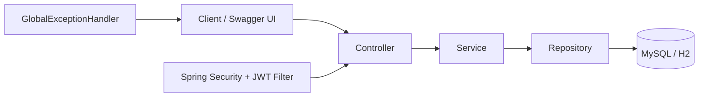
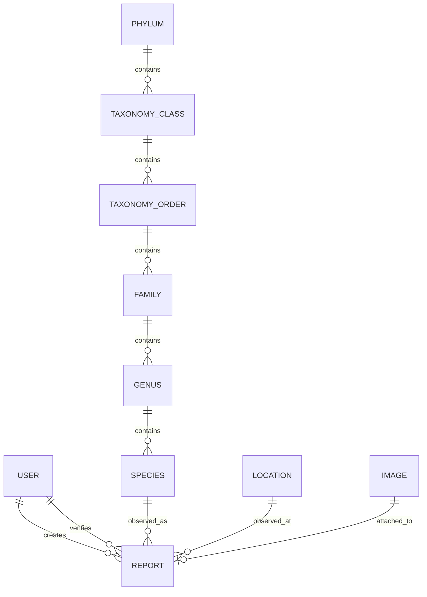

# Wildlife Reporter Backend

## 项目简介

Wildlife Reporter 是一个基于 Spring Boot 的野生动物观察记录后端项目。项目用于管理用户、物种分类、地理位置和观察记录，并提供 JWT 鉴权、分页筛选、统一 API 响应、全局异常处理及 OpenAPI 文档。

本项目源自 UIUC CS 411 课程项目，目前正在逐步将原有的服务端页面应用整理为结构更清晰的 RESTful 后端。仓库中仍保留部分 Thymeleaf 页面和旧版 MVC 接口。

## 技术栈

| 分类 | 技术 |
| --- | --- |
| 开发语言 | Java 17 |
| Web 框架 | Spring Boot 3.4、Spring MVC |
| 数据访问 | Spring Data JPA、Hibernate |
| 数据库 | MySQL 8.0 |
| 测试数据库 | H2 |
| 安全认证 | Spring Security、JWT、BCrypt |
| API 文档 | springdoc-openapi、Swagger UI |
| 参数校验 | Jakarta Validation |
| 地理数据 | GeoTools、JTS |
| 测试 | JUnit 5、Mockito、MockMvc、Spring Boot Test |
| 构建工具 | Maven Wrapper |
| 容器化 | Docker、Docker Compose |

## 系统架构

项目采用常见的分层后端结构：



主要目录：

```text
src/main/java/com/wildlifedb
├── api/          # ApiResponse、PageResponse 等通用响应模型
├── config/       # OpenAPI 配置
├── controller/   # REST Controller 和遗留 MVC Controller
├── dto/          # 请求与响应 DTO
├── entity/       # JPA 实体
├── exception/    # 业务异常及全局异常处理
├── repository/   # Spring Data JPA Repository 和查询 Specification
├── security/     # JWT 过滤器、鉴权入口和 Security 配置
├── service/      # 认证、观察记录和遗留业务服务
└── util/         # 分类及测试数据导入辅助代码
```

各层职责：

- **Controller**：接收 HTTP 请求、校验输入并返回统一的 `ApiResponse<T>`。
- **Service**：处理认证、观察记录 CRUD、权限判断等业务逻辑。
- **Repository**：通过 Spring Data JPA 访问数据库；观察记录筛选使用 JPA `Specification`。
- **Database**：本地及 Docker 环境使用 MySQL，自动化测试使用内存 H2 数据库。

## 数据库设计

核心实体及关系如下：



| 实体 | 说明 |
| --- | --- |
| `User` | 用户账号、邮箱、BCrypt 密码和 verifier 标记 |
| `Report` | 观察记录，关联用户、物种、地点、验证用户和可选图片 |
| `Species` | 物种学名、常用名、灭绝状态及所属属 |
| `Genus` | 属，关联科 |
| `Family` | 科，关联目 |
| `TaxonomyOrder` | 目，关联纲 |
| `TaxonomyClass` | 纲，关联门 |
| `Phylum` | 门，并以字符串保存 kingdom 标识 |
| `Location` | 城市、州、生态区和 WKT 地理边界 |
| `Image` | 观察记录图片 URL |

Observation、Species、Location 和 Taxonomy 的查询索引说明见
[`docs/database-indexes.md`](docs/database-indexes.md)。

当前没有版本化的 Flyway migration 文件或自动生产数据脚本。默认使用
`spring.jpa.hibernate.ddl-auto=update` 创建或更新 MySQL 表结构。

## 核心功能

- 用户注册和登录。
- BCrypt 密码加密。
- 无状态 JWT 鉴权及统一的 401、403 错误响应。
- 公开分页查询 Observation。
- 按物种名称、地点、日期范围和 taxonomy/category 筛选 Observation。
- 登录用户创建 Observation。
- Observation 所有者或 verifier 更新、删除记录。
- 随机物种查询和物种基本信息查询。
- 统一 API 响应格式：`code`、`message`、`data`、`timestamp`。
- 参数错误、资源不存在、数据库异常和服务器异常的全局处理。
- Swagger/OpenAPI 接口文档。
- Observation、Species 的 Service 单元测试及 Controller 接口测试。

## 主要 REST API

| 方法 | 路径 | 认证 | 说明 |
| --- | --- | --- | --- |
| `POST` | `/auth/register` | 否 | 注册并返回 JWT |
| `POST` | `/auth/login` | 否 | 登录并返回 JWT |
| `GET` | `/observations` | 否 | 分页及多条件查询 Observation |
| `POST` | `/observations` | 是 | 创建 Observation |
| `PUT` | `/observations/{id}` | 是 | 更新 Observation |
| `DELETE` | `/observations/{id}` | 是 | 删除 Observation |
| `GET` | `/api/v1/getspecies` | 否 | 返回一个随机物种 ID |
| `GET` | `/api/v1/species/{id}` | 否 | 查询物种基本信息 |

认证和 Observation 接口同时支持 `/api/v1/auth/**` 与
`/api/v1/observations/**` 版本化路径。

## API 文档

应用启动后可访问：

- Swagger UI：<http://localhost:8080/swagger-ui.html>
- OpenAPI JSON：<http://localhost:8080/v3/api-docs>

调用受保护接口前，先通过注册或登录接口取得 `data.token`，然后在 Swagger UI
的 **Authorize** 对话框中填写 token。通过命令行调用时使用：

```text
Authorization: Bearer <token>
```

## 本地启动

### 环境要求

- JDK 17
- MySQL 8.0
- PowerShell

项目包含 Maven Wrapper，因此不要求全局安装 Maven。

### 1. 创建数据库

默认本地配置连接数据库 `test`，用户名和密码均为 `test`：

```sql
CREATE DATABASE test CHARACTER SET utf8mb4 COLLATE utf8mb4_unicode_ci;
CREATE USER 'test'@'localhost' IDENTIFIED BY 'test';
GRANT ALL PRIVILEGES ON test.* TO 'test'@'localhost';
FLUSH PRIVILEGES;
```

也可以通过环境变量使用其他连接信息：

```powershell
$env:DB_URL = "jdbc:mysql://localhost:3306/wildlife?useSSL=false&serverTimezone=UTC"
$env:DB_USERNAME = "wildlife"
$env:DB_PASSWORD = "your-database-password"
$env:JWT_SECRET = "replace-with-a-random-secret-of-at-least-32-bytes"
$env:JWT_EXPIRATION_SECONDS = "3600"
```

### 2. 启动应用

```powershell
cd "C:\Users\xiudo\Documents\wildlife reporter\backend"
.\mvnw.cmd spring-boot:run
```

应用默认运行在 <http://localhost:8080>。

### 3. 运行测试

```powershell
.\mvnw.cmd test
```

测试使用 `src/test/resources/application-test.properties` 中配置的 H2 内存数据库，
不会连接本地 MySQL。

## Docker Compose 启动

Docker Compose 包含：

- `app`：Spring Boot 后端，默认映射到 `8080`。
- `mysql`：MySQL 8.0，默认映射到 `3306`。
- `mysql_data`：持久化 MySQL 数据的命名 volume。

启动：

```powershell
cd "C:\Users\xiudo\Documents\wildlife reporter\backend"
$env:JWT_SECRET = "replace-with-a-random-secret-of-at-least-32-bytes"
docker compose up --build -d
docker compose logs -f app
```

默认开发配置：

| 配置 | 默认值 |
| --- | --- |
| Database | `wildlife` |
| MySQL user | `wildlife` |
| MySQL password | `wildlife_dev_password` |
| MySQL root password | `root_dev_password` |
| App port | `8080` |
| MySQL port | `3306` |

可在执行 `docker compose up` 前设置以下变量覆盖默认值：

```powershell
$env:MYSQL_DATABASE = "wildlife"
$env:MYSQL_USER = "wildlife"
$env:MYSQL_PASSWORD = "your-database-password"
$env:MYSQL_ROOT_PASSWORD = "your-root-password"
$env:APP_PORT = "8080"
$env:MYSQL_PORT = "3306"
docker compose up --build -d
```

停止服务但保留数据库：

```powershell
docker compose down
```

删除服务和本地 Docker 数据：

```powershell
docker compose down -v
```

## 测试账号与测试数据

项目当前**没有内置的固定测试账号**。可通过注册接口创建本地账号：

```powershell
curl.exe -X POST "http://localhost:8080/auth/register" `
  -H "Content-Type: application/json" `
  -d '{"userId":"wildlife_tester","email":"tester@example.com","password":"StrongPass123"}'
```

登录：

```powershell
curl.exe -X POST "http://localhost:8080/auth/login" `
  -H "Content-Type: application/json" `
  -d '{"email":"tester@example.com","password":"StrongPass123"}'
```

注册和登录响应中的 `data.token` 可用于 Observation 写接口。

项目当前也没有 Docker 启动时自动导入的 Species、Location 或 Observation
生产数据。创建 Observation 前，数据库中必须已有对应的 Species；Location
为可选字段。自动化测试会在 H2 中创建自己的隔离测试数据，测试结束后自动清理。

## 未来改进方向

- 添加正式的 Flyway migration 和可控的开发环境 seed 数据。
- 将遗留的 Thymeleaf/MVC 接口迁移到统一 REST API，并移除 URL 中的明文登录参数。
- 为 Species 和 Taxonomy 增加独立的 Service、DTO 和完整 CRUD API。
- 增加 refresh token、注销、角色模型及更细粒度的授权规则。
- 增加 Testcontainers MySQL 集成测试，减少 H2 与 MySQL 的行为差异。
- 增加 JaCoCo 覆盖率报告和 CI 流水线。
- 为 Observation 增加图片上传、审核历史和状态流转。
- 引入统一的数据库迁移、日志、监控和生产环境配置管理。

## 项目来源

本项目是在 UIUC CS 411 课程 Team 015 原始项目基础上的持续整理版本，当前工作重点是后端结构、安全认证、REST API、测试和本地开发环境。
